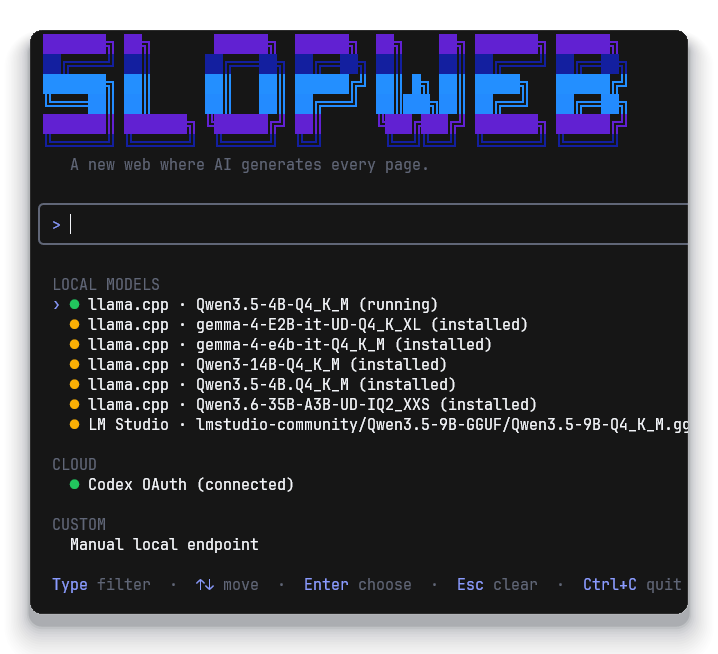
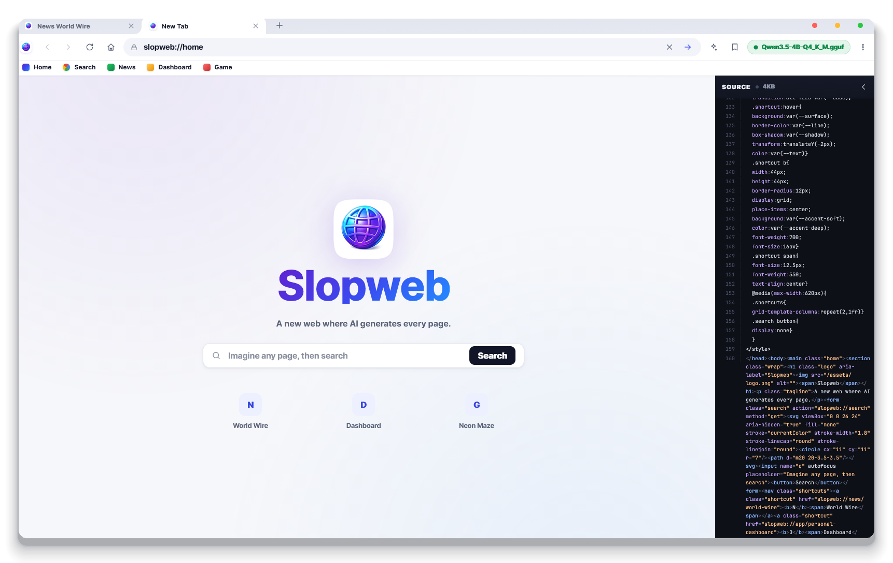

<p align="center">
  
</p>

<h1 align="center">Slopweb</h1>

<p align="center">A new web where AI generates every page.</p>

## Quick Start

```powershell
npm install -g slopweb
slopweb
```

Pick a detected local model, Codex OAuth, or a manual OpenAI-compatible endpoint in the launcher. Slopweb starts a local-only server and prints the URL, usually `http://localhost:8787`.

<p align="center">
  
</p>

## What It Does

- Generates pages from addresses, links, and searches.
- Streams HTML into the page while the model is still writing.
- Works with local OpenAI-compatible servers through the Vercel AI SDK.
- Can fall back to Codex OAuth when local generation is not configured.
- Saves generated pages as real `.html` files and shows the saved path in the address bar.

<p align="center">
  
</p>

Generated pages are saved in the user's Slopweb app-data folder by default. Set `SLOPWEB_PAGES_DIR` to choose a different folder.

## Commands

```powershell
slopweb                         # start the launcher and server
slopweb open                    # start and open the browser
slopweb models                  # list detected local models
slopweb --base-url http://localhost:11434/v1 --model llama3.2
slopweb --local --model qwen2.5-coder:7b
slopweb --codex                 # use Codex OAuth
slopweb login                   # start Codex device auth
slopweb status                  # check local AI and Codex status
slopweb doctor                  # print environment diagnostics
```

Useful server options:

```powershell
slopweb --port 9000
slopweb --strict-port
slopweb --lan
slopweb --no-picker
```

## Local Models

Slopweb detects common local runtimes and OpenAI-compatible APIs, including Ollama, LM Studio, llama.cpp/llamafile, vLLM, SGLang, Jan, text-generation-webui, and KoboldCpp.

Use auto-detection first:

```powershell
slopweb models
slopweb
```

Use an explicit endpoint when auto-detection is not enough:

```powershell
slopweb --base-url http://localhost:11434/v1 --model llama3.2
```

Custom provider definitions can live in:

```text
~/.slopweb/models.json
```

Example:

```json
{
  "providers": {
    "workstation": {
      "name": "Workstation llama.cpp",
      "baseUrl": "http://127.0.0.1:8080/v1",
      "models": ["Qwen3.5-9B-Q4_K_M.gguf"]
    }
  }
}
```

Detection knobs:

```powershell
$env:SLOPWEB_BASE_URLS="http://127.0.0.1:8080/v1;http://127.0.0.1:1234/v1"
$env:SLOPWEB_MODEL_DIRS="D:\Models;E:\LLMs"
$env:SLOPWEB_LIVE_DETECT_TIMEOUT_MS="300"
$env:SLOPWEB_DETECT_TIMEOUT_MS="1000"
```

`SLOPWEB_LIVE_DETECT_TIMEOUT_MS` controls the fast generation/status path. `SLOPWEB_DETECT_TIMEOUT_MS` controls the fuller launcher and `slopweb models` scan.

Set `SLOPWEB_DEBUG_TIMING=1` to print model-detection and page-stream timing diagnostics.

## Codex OAuth

```powershell
slopweb login
slopweb --codex
```

Codex credentials stay in your local Codex credential store. Slopweb does not store OAuth tokens in generated pages.

## Requirements

- Node.js `18.17` or newer
- A local OpenAI-compatible model server, or Codex CLI access for OAuth generation

The HTTP API is restricted to localhost by default. Use `--lan` only when you intentionally want LAN access.

## Run From Source

```powershell
pnpm install
pnpm start
```

Run the syntax check:

```powershell
pnpm run check
```

## License

MIT
